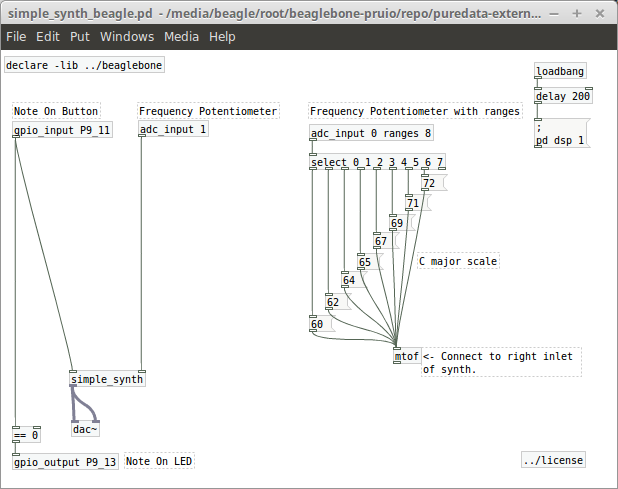
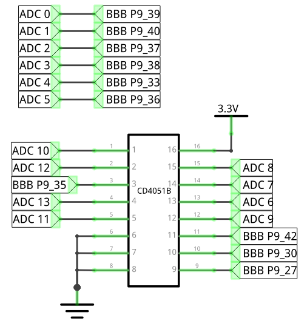

# BeagleBone PRU IO

This is a software library that allows access to the General Purpose Inputs and Outputs and the Digital Analog Converters in the [BeagleBone Black single board computer](http://beagleboard.org/black).  

## Features

* Can be used as a library for programs written in the C language or as an external for [PureData](http://puredata.info) patches.
* Analog Digital Converters and General Purpose IO pins can be configured without the need of writing or configuring [Device Tree Overlays](https://learn.adafruit.com/introduction-to-the-beaglebone-black-device-tree?view=all).
* To avoid high CPU usage, input polling is done using one of the Programmable Real Time Units [PRUs](https://github.com/beagleboard/am335x_pru_package/blob/master/Documentation/01-AM335x_PRU_ICSS_Overview.pdf?raw=true) available in the [AM335X](http://www.ti.com/product/am3358) chip (the Beagle Bone Black's main processor).
* Easy to use. Users don't have to learn how to access the hardware features, no need to compile PRU code, etc.
* ADC inputs are sampled at 1500 samples per second. Useful for sensors, potentiometers, etc. Not so much for audio signals.

## Usage

You'll need to figure out yourself how to get internet access on your Beaglebone, how to run PD patches and/or how to compile C programs. All of the following was tested on [Debian Linux](http://beagleboard.org/latest-images) running on a BeagleBone Black revision C.
 
### From a PD patch

Here's an example patch that uses the library to get input from a potentiometer and a pushbutton and drives an LED. See the [test-patches](puredata-external/test-patches) directory and the help files in [puredata-external](puredata-external) for more info.

You're probably using a headless BeagleBone (no screen, keyboard or mouse) so you'll need to create your PD patches on a different computer and then copy them to your BeagleBone. I have included a 64 bit Linux version of the PD library in the puredata-external directory. You'll need to rename the `beaglebone.pd_linux_x86_64` file to `beaglebone.pd_linux` and put it somewhere in your PD path if you want to use it while creating patches in your computer. Binaries for other platforms are welcome.



### From a C program

Here's a possible way of using the library from a C program. For a full example and it's makefile, check the [c-example directory](c-example)

```C
#include <beaglebone_pruio.h>
#include <beaglebone_pruio_pins.h>

int main(int argc, const char *argv[]){
    // Initialize library and hardware.
    beaglebone_pruio_start();

    // Get input from ADC channel 2.
    int beaglebone_pruio_init_adc_pin(2); 

    // Use pin P9_11 as an input.
    int beaglebone_pruio_init_gpio_pin("P9_11", BEAGLEBONE_PRUIO_INPUT_MODE); 

    // Use pin P9_12 as an output.
    int beaglebone_pruio_init_gpio_pin("P9_12", BEAGLEBONE_PRUIO_OUTPUT_MODE);

    int output_value = 0;
    while(!exit_condition){
        // Get available messages from digital and analog inputs and parse them:
        beaglebone_pruio_message message;
        while(beaglebone_pruio_messages_are_available()){
            beaglebone_pruio_read_message(&message);

            // Message from gpio
            if(message.is_gpio && message.gpio_number==P9_11){
                printf("P9_11: %i\n", message.value);
            }

            // Messages from adc
            else if(!message.is_gpio && message.adc_channel==2){
                printf("ADC_2: %i\n", message.value);
            }
        }

        // Toggle output pin
        output_value = !output_value;
        beaglebone_pruio_set_pin_value(P9_12, output_value); 

        sleep(1);
    }

    beaglebone_pruio_stop();
}
```

## Installation

Make sure your BeagleBone has internet access, download the library and run the [install.sh script](scripts/install.sh). __Read the script before running it!__ You might not want to run some of the commands in there.

```Bash
git clone https://github.com/outer-space-sounds/beaglebone-pruio.git beaglebone-pruio
cd beaglebone-pruio/scripts
./install.sh
```

## Additional Hardware

The library assumes there is an [analog multiplexer](http://www.ti.com/lit/ds/symlink/cd4051b.pdf) connected at the input of ADC6. This allows for using 14 ADC channels instead of just 7. 3 GPIO pins are used to control the mux: P9_27, P9_30 and P9_42A. An option to turn this off can be added if there is interest. Here's a schematic. Pins labeled "BBB" are pins in the BeagleBone Black, pins labeled with "ADC" are the analog inputs you can use.



## Bugs, Feature Requests, Roadmap, Questions

Use the [issue tracker](issues) in this github repository.

## Compiling the Library

This is only needed if you want to somehow change the library (fix a bug, contribute a new feature, whatever).

There are two main components of the library: the ARM part that runs on the main processor in the BeagleBone and the PRU part that runs on one of the PRU units. Communication between both processors is done through a ring buffer in shared memory space. 

Compilation is done on the BeagleBone itself (I never bothered to set up a cross-compilation thing) so you'll need to install two compilers on your board. First one, for the ARM part is gcc, which can be installed by doing `apt-get install build-essential`. The second one, for the PRU part, is Texas Instrument's PRU compiler, which can be downloaded [here](http://software-dl.ti.com/codegen/non-esd/downloads/beta.htm). It's free as in beer and you'll need to sign up with TI before downloading. Uncompress it and put it in the `vendors/pru_2.0.0B2` directory so that our makefile finds it and uses it. Your `vendors` directory should end up looking like this:

```
vendors
│ 
├── am335x_pru_package
│   ├── am335xPruPackage_1_2_Manifest.pdf
│   ├── am335xPruReferenceGuide.pdf
│   ├── Documentation
│   ├── Makefile
│   ├── pru_sw
│   └── README.txt
└── pru_2.0.0B2
    ├── bin
    ├── bin.cmd
    ├── example
    ├── include
    ├── lib
    ├── License.txt
    ├── LICENSE.txt
    ├── man
    ├── PRU_Compiler_2_0_manifest.html
    └── README.txt
```

After having both compilers, `library/Makefile` takes care of everything. If you're changing PRU code, also take a look at `AM3359_PRU.cmd` and `bin.cmd`.

## License

Beaglebone Pruio.

Copyright (C) 2015 Rafael Vega <rvega@elsoftwarehemuerto.org>

This program is free software: you can redistribute it and/or modify it under the terms of the GNU General Public License as published by the Free Software Foundation, either version 3 of the License, or (at your option) any later version.  

This program is distributed in the hope that it will be useful, but WITHOUT ANY WARRANTY; without even the implied warranty of MERCHANTABILITY or FITNESS FOR A PARTICULAR PURPOSE.  See the GNU General Public License for more details.

You should have received a copy of the GNU General Public License along with this program.  If not, see <http://www.gnu.org/licenses/>.
