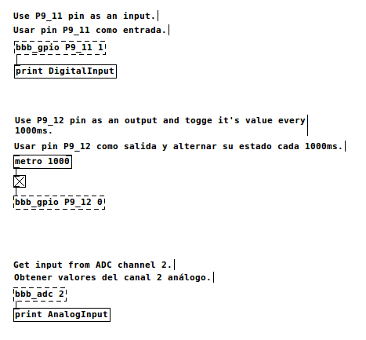

# Lib BBB PRUIO. Manual de Usuario.

## 1. ¿Qué es?

[Beagle Bone Black](http://beagleboard.org/black) (BBB) es un computador del tamaño de una tarjeta bancaria, diseñado para ser usado por entusiastas y aficionados de la tecnología en el desarrollo de aplicaciones embebidas. La BBB cuenta con un sistema de entradas y salidas digitales (GPIO) y analógicas (ADC) que permiten conectar diferentes sensores y actuadores electrónicos e interactuar con ellos desde software escrito por el usuario.

Sin embargo, para utilizar efectivamente los sistemas de GPIO y ADC, es necesario un entendimiento mas bien profundo de cómo funcionan algunos componentes de la BBB y sus herramientas de desarrollo, lo que hace que su uso adecuado por parte de aficionados sea improbable.

Esta librería pretende proporcionar una manera sencilla de usar las entradas y salidas digitales de la BBB y las entradas analógicas, sin que el usuario tenga que comprender mas que una interfaz de programación (API) sencilla.

En su forma actual e influido por el interés del autor por la construcción de instrumentos musicales electrónicos, la librería puede ser usada desde programas escritos en C y en parches de [PureData](http://puredata.info).

## 2. Manejo Básico de la BBB

El usuario/programador de esta librería debe tener un conocimiento previo en el manejo de la BBB que no será explicado en este documento. Específicamente, se asume que: 

* Se está [corriendo un sistema operativo Debian Linux en la Beagle](http://beagleboard.org/project/Debian/).
* Se está familiarizado con el uso de una terminal de Linux.
* Se está usando una terminal remota via SSH desde otro computador para acceder al sistema de la BBB.
* El usuario está en capacidad de compilar y ejecutar programas de C en Linux y/o correr parches de PureData desde una terminal.
* El usuario conoce el sistema de gestión de código y versiones "git".
* La BBB tiene acceso a internet por cualquier medio.

## 3. Instalación de la librería

Se debe conectar la BBB a internet, obtener la librería y su código usando git e instalarla usando el script que se encuentra en el directorio `scripts/run-on-beagle/install.sh`. El script instalará los archivos de la librería en `/usr/lib/libbbb_pruio.*` y `/usr/include/bbb_pruio.h` y dos objetos (externals) de PureData en `/usr/local/lib/pd-externals`.

Adicionalmente, el script remplazará una librería del sistema llamada am335x_pru_package por una versión modificada. Esta modificación no será necesaria en futuras versiones.


```bash
cd ~
git clone https://github.com/rvega/libbbb_pruio 
cd libbbb_pruio
git submodule update --init --recursive
cd scripts/run-on-beagle
./install.sh

```

## 4. Como usar la librería en un parche de PureData.

La siguiente imágen muestra un parche de PureData que utiliza los dos objetos disponibles.



## 5. Como usar la librería en un programa escrito en C.

El siguiente código ilustra la manera como se puede usar la librería en un programa escrito en C. 

```C
#include <bbb_pruio.h>

int main(int argc, const char *argv[]){
    // Inicializar la librería y el hardware.
    bbb_pruio_start();

    // Obtener entradas del pin análogo número 2.
    int bbb_pruio_init_adc_pin(2); 

    // Usar el pin digital P9_11 como entrada.
    int bbb_pruio_init_gpio_pin("P9_11", 1); 

    // Usar el pin digital P9_12 como salida.
    int bbb_pruio_init_gpio_pin("P9_12", 0); 

    int output_value = 0;
    while(!exit_condition){
        // Obtener nuevos valores e interpretarlos:
        while(bbb_pruio_messages_are_available()){
            unsigned int message;
            bbb_pruio_read_message(&message);

            // Si llegó un valor de un pin digital
            if(bbb_pruio_message_is_gpio(&message)){
                int pin_number = bbb_pruio_get_gpio_number(&message);
                char pin_name[256];
                pin_name = bbb_pruio_get_pin_name(pin_number);
                int value = bbb_pruio_get_gpio_value(&message);
                printf("Digital pin %s changed to value %i \n", pin_name, value);
            }
            // Llego un valor de un pin analógico
            else{
                int channel_number = bbb_pruio_get_adc_channel(&message);
                int value = bbb_pruio_get_adc_value(&message);
                printf("Analog pin %i changed to value %i \n", channel_number, value);
            }
        }

        // Alternar el valor del pin digital de salida
        output_value = !output_value;
        bbb_pruio_set_gpio_pin("P9_12", output_value); 

        sleep(1);
    }

    // Detener el hardware y liberar recursos de la librería.
    bbb_pruio_stop();
}

```

## 6. Documentación de la API.

A continuación está el listado de todas las funciones de la interfáz de programación de la librería:

```C
/**
 * Inicializa el hardware de PRU, GPIO y ADC y empieza a obtener 
 * información de las entradas digitales y analógicas.
 */
int bbb_pruio_start();
```

```C
/**
 * Detiene el hardware utilizado y libera recursos usados por la librería
 */
int bbb_pruio_stop();
```

```C
/**
 * Configura un pin analógico para ser leido.
 */
int bbb_pruio_init_adc_pin(unsigned int pin_number); 
```

```C
/**
 * Configura un pin digital para ser leido o escrito.
 * modo 1 es entrada, modo 0 es salida.
 */
int bbb_pruio_init_gpio_pin(char* gpio_name, int mode); 
```

```C
/**
 * Establece el valor de un pin de salida.
 */
inline void bbb_pruio_set_pin_value(int gpio_number, int value);
```

```C
/**
 * Retorna 1 si hay nuevos valores para ser leidos.
 */
inline int bbb_pruio_messages_are_available();
```

```C
/**
 * Pone un nuevo valor en la direccion especificada por *message.
 */
inline void bbb_pruio_read_message(unsigned int *message);
```


## Licencia

Lib BBB Pruio

Copyright (C) 2014 Rafael Vega <rvega@elsoftwarehemuerto.org>

Este programa es software libre: usted puede redistribuirlo y/o modificarlo bajo los terminos de la licencia GNU General Public License version 3 publicada por la Free Software Foundation, o una versión mas nueva.

Este programa es distribuido con la fe de que sea útil, pero SIN NINGUNA GARANTÍA PARA NINGUN PROPOSITO PARTICULAR. Ver la licencia GNU General Public License para mas detalles.

El texto completo de la licencia puede ser obtenido en <http://www.gnu.org/licenses/>.

## License

Lib BBB Pruio

Copyright (C) 2014 Rafael Vega <rvega@elsoftwarehemuerto.org>

This program is free software: you can redistribute it and/or modify it under the terms of the GNU General Public License as published by the Free Software Foundation, either version 3 of the License, or (at your option) any later version.  

This program is distributed in the hope that it will be useful, but WITHOUT ANY WARRANTY; without even the implied warranty of MERCHANTABILITY or FITNESS FOR A PARTICULAR PURPOSE.  See the GNU General Public License for more details.

You should have received a copy of the GNU General Public License along with this program.  If not, see <http://www.gnu.org/licenses/>.
